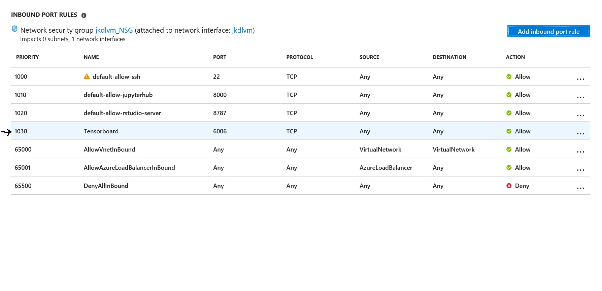

# Workshop environment set up

### Provision Deep Learning Virtual Machine
Use Azure Portal to provision a Deep Learning Virtual Machine. Follow the instructor. Don't forget to change a DNS name.

### Configure ports for Tensorboard


### Create Anaconda environment
Use ssh to logon to the virtual machine and create a new Anaconda environment
```
ssh <user name>@<vm name>.<region>.cloudapp.azure.com
conda create -n bai python=3.5 anaconda
source activate bai
```
### Install azure-cli 
Make sure you have activated the new environment
```
pip install azure-cli
```

## Clone the workshop github site
```
cd
mkdir repos
cd repos
mkdir Azure_AI_Infrastructure
cd Azure_AI_Infrastructure
git clone https://github.com/jarokaz/Azure_AI_Infrastructure.git
```

## (Optional) Configure root directory for Jupyter Hub
By default Jupyter Hub on DL VM starts Jupyter notebooks with the root directory set to `~/notebooks`. You can either move the workshop repo to this folder or alternatively reconfigure Jupyter Hub to use another root folder. To do that modify `/etc/jupyterhub/jupyterhub_config.py` to point to the new root folder.
```
c.Spawner.notebook_dir = '~/repos`
```
And restart `Jupyterhub`
```
sudo service jupyterhub stop
sudo service jupyterhub start
```


## Log on to Jupyter Lab
Use the browser to navigate to
```
https://<vm name>.<region name>.cloudapp.azure.com:8000
```


## Explore the workshop's repo
Follow the instructor in exploring the workshop's repo. 

TIP: Use the Jupyter Lab mode. It is great.


